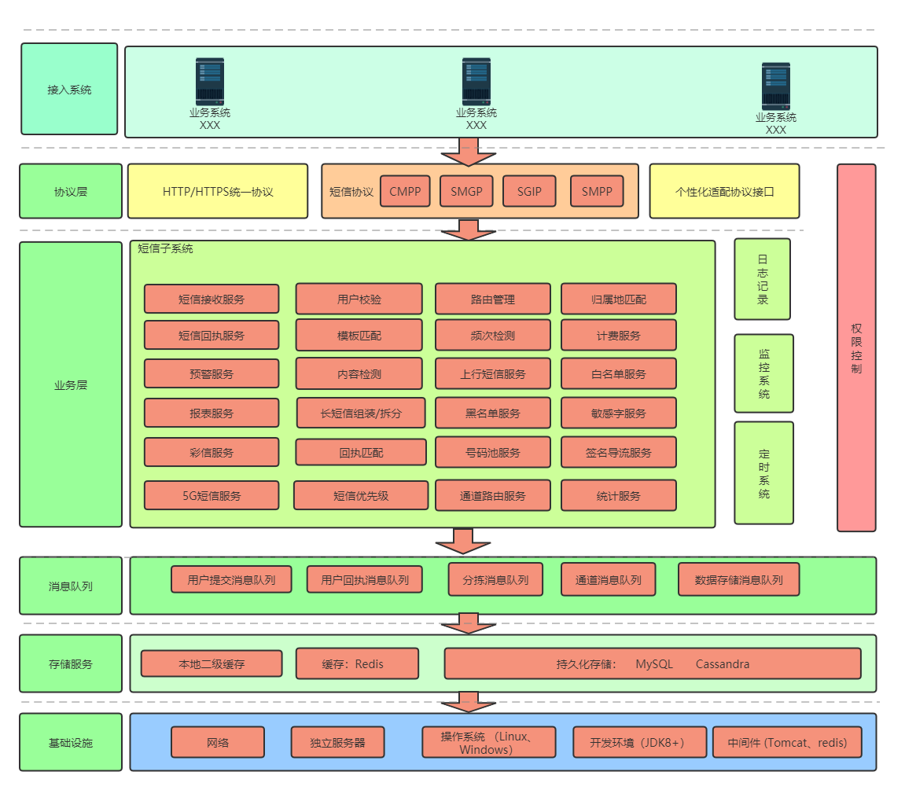

# 信相通短信平台

## 介绍
  为短信开发者提供一个入门的脚手架项目，让开发者迅速掌握CMPP,SGIP,SMPP,SMGP等协议。开发者可以更专注于企业个性化业务的开发，减少学习时间成本。
  此平台由河北庄点科技有限公司研发（http://www.drondea.com/ ）
## 特别注意
-  此项目仅为单机版，性能和扩展性都有局限性。此项目仅供研发交流学习，禁止商用。
-  此项目依赖sms-quick，我们也做了开源，请走[传送门](https://gitee.com/zhuang-dian/quick-sms)

## 在线体验

- 目前只提供管理运营平台的演示
- 账号密码：test/123456
- 请勿修改密码，影响他人体验
- 此平台仅用于功能演示，不会实际接收和发送短信
- 演示服务器配置有限，如有卡顿，请谅解

演示地址：http://192.144.145.245:8888/

## 商业合作 
- 我们提供商业授权和基于开源版本的技术服务（包括代码解答和技术咨询），有意向请进群交流
- 我们也提供短信平台的商业版本的租用服务（做个广告），有意向请进群交流

## 技术交流
短信平台QQ交流群：


## 软件架构
  
  为了减少部署成本，单机版去掉了redis和队列，通过本地缓存来实现redis存储，通过扫描数据库表来实现队列功能。
## 协议支持
协议| 下游用户对接 | 上游通道对接 |
-----------|-------------| ------------|
CMPP2.0 | 支持 | 支持 |
CMPP3.0 | 支持 | 支持 |
CMGP | 支持 | 支持 |
SMPP | 支持 | 支持 |
SGIP | 不支持 | 支持 |
[自研HTTP接口](https://gitee.com/zhuang-dian/sms-platform-stand-alone/wikis) | 支持 | 支持 |
迈远http1.0 | 支持 | 不支持 |
迈远http2.0 | 支持 | 支持 |

## 环境要求

- JDK1.8+
- MySQL8.0+
- Maven3.0+
- Tomcat9.0+

## 主要技术

技术 | 名称 | 版本 
----|------|----
Spring MVC | 应用框架 | 5.2.9.RELEASE 
MyBatis | ORM框架 | 3.4.6  
Log4J| 日志组件 | 2.11.1
Druid | 数据库连接池 | 1.2.4
Hibernate Validator | 后端校验框架 | 5.2.4.Final
Google Guava | 缓存和工具 | 28.2-jre
ShardingSphere | 分库分表 | 5.0.0-alpha
Quick-SMS | 自研[短信协议中间件](https://gitee.com/zhuang-dian/quick-sms) | 最新
LayUI | js框架 | v2.5.4

此平台使用了自研的短信协议中间件，重点实现了滑动窗口控速和减少了异步开发的门槛，如果只想使用中间件，请走[传送门](https://gitee.com/zhuang-dian/quick-sms)。

## 工程结构                                                                                                                                                           

```
sms
├── docs -- 接口文档和使用说明书
├── sms-netway-sender -- 发送短信的网关、分拣、发送器服务都在这个工程里面，发送短信的基础项目
├── sms-system
|    ├── sms-action -- sms-admin工程用到的一些公共方法
|    ├── sms-admin -- 运营平台服务，企业、客户、权限等的管理维护
|    ├── sms-enterprise -- 客户端服务
|    ├── sms-service -- 业务层接口、接口实现
├── sms-system-dao -- DAO层
├── sms-util -- 项目中使用到的工具类
```                                                                                                                                    
      
                                                                                                                                     

## 安装教程

 **本地部署** 
1. 下载项目
2. 创建数据库sms_business、sms_send，数据库编码为UTF-8
3. 在sms_business库执行docs/sql/business.sql，初始化业务数据库
4. 在sms_send库执行docs/sql/send.sql，初始化短信记录数据库   
5. 修改各工程(比如：sms-admin-web/src/main/resources)的database.properties，更新MySQL地址、端口、账号和密码
6. 运行项目
  
-     sms-netway-sender工程是发送短信的基础项目，发送短信必须启动；
-     sms-admin工程是运营管理平台，企业、用户、白名单、黑名单、通道等的维护管理，项目中一些参数的设置，前期需要先启动该服务，维护好相关数据。
-     sms-enterprise工程是客户平台，客户端web发送入口，以及发送记录等的查看，通过页面发送的下游用户，可以给用户部署该服务，登录账号、
      密码就是创建企业用户时填写的账号密码。

7. 以上三个项目需要部署到Tomcat的ROOT目录中，即访问时不能加项目名称
8. 以sms-admin为例,使用http://ip:port/public/admin/login.jsp访问运营管理平台（ip和port根据自己启动服务的端口号进行修改）

## 使用说明

**使用文档**
1. 短信运营管理平台的使用说明书在[docs/平台使用说明书/信相通运营管理平台使用说明书V3.0.docx](docs/平台使用说明书/信相通运营管理平台使用说明书V3.0.docx)
2. 企业管理端的使用说明书在[docs/平台使用说明书/信相通客户端使用说明书V3.0.docx](docs/平台使用说明书/信相通客户端使用说明书V3.0.docx)

**短信发送**
1.  如果是HTTP的请求，直接调用网关接口即可，参考WiKi中的接口文档
2.  如果是CMPP\SGIP\SMPP\SMGP等协议的，需要在运营平台给需要连接的用户开通企业用户的账户即可，下游配置上相关参数就能链接到服务器

**运营平台**
-   账户管理
        ---系统用户的添加，权限、角色的维护

-   企业管理
        ---对下游企业用户的维护
        
        

-   通道产品
        ---对上游通道的维护，以及对用户所需的产品的维护
        

-   业务管理
        ---对系统中白名单、黑名单、手机号码路由、手机号码归属地的维护
        
        

-   短信管理
        ---主要是对发送短信的状态、历史记录的查询
        

-   报表管理
        ---对发送短信的日报、月报等的查看和导出

-   财务管理
        ---企业用户的充值、充值记录管理

-   彩信管理
        ---彩信发送中用到的素材和彩信模板的管理维护

-   系统设置
        ---项目中使用的一些系统参数的设置，告警服务的配置，系统工具等

**客户管理平台**
-   企业管理---企业用户和企业通讯录的维护
-   短信管理---发送短信、发送记录的查看、发送状态报告的查看、本企业的短信模板维护
        
        
        
        
-   彩信管理---客户端发送彩信的入口、彩信素材、彩信模板的维护
-   财务管理---发票管理、发送的短信统计

## 常见问题

1. 缺少sms-quick.jar包<br/>
  此项目依赖sms-quick，我们也做了开源，自己引入即可，请走[传送门](https://gitee.com/zhuang-dian/quick-sms)
2. 演示地址不能打开<br/>
  由于服务器资源有限，不定时会关闭演示地址，如需功能演示，进群联系管理员即可
